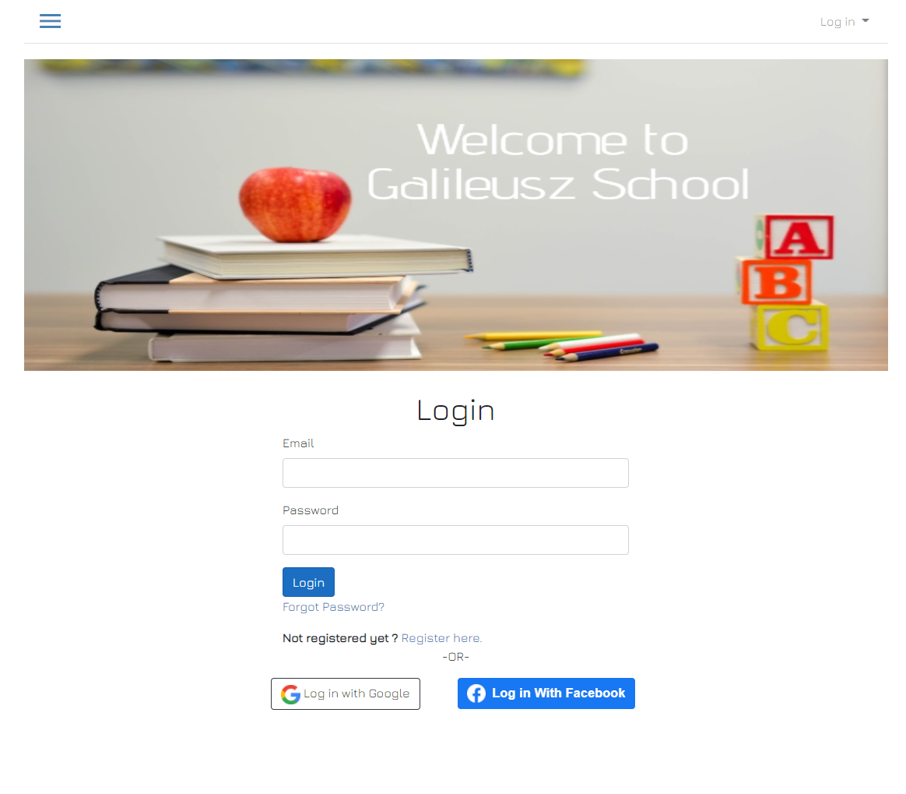
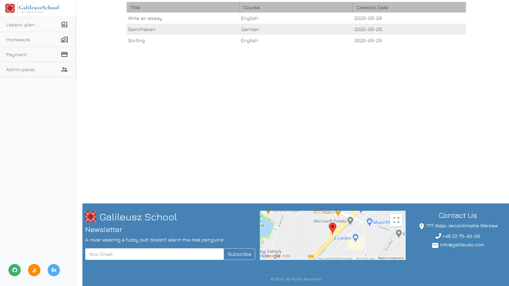
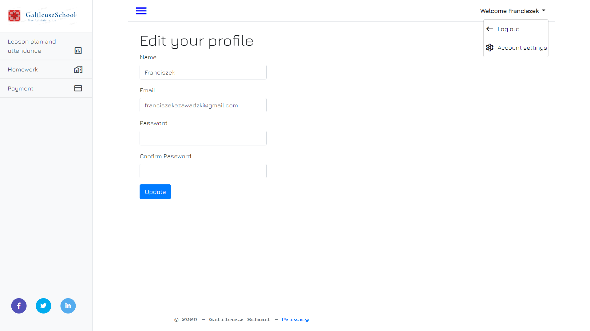
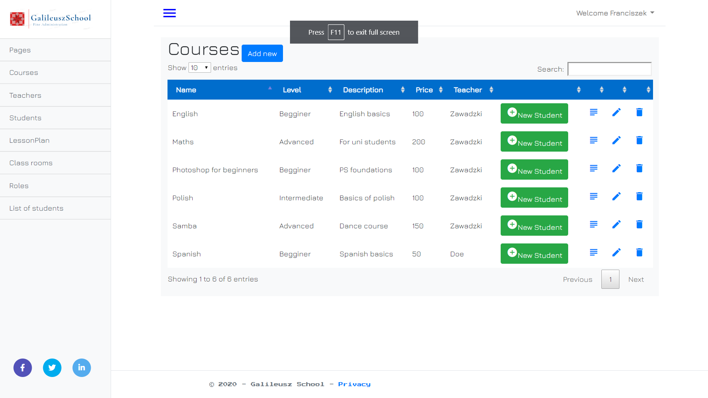
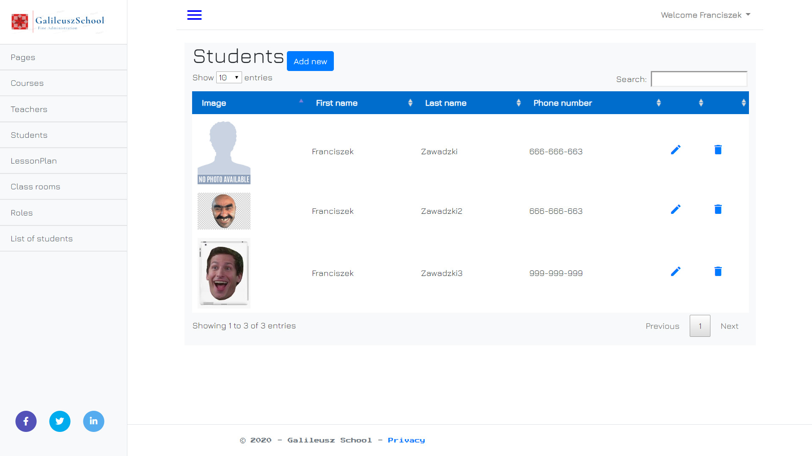
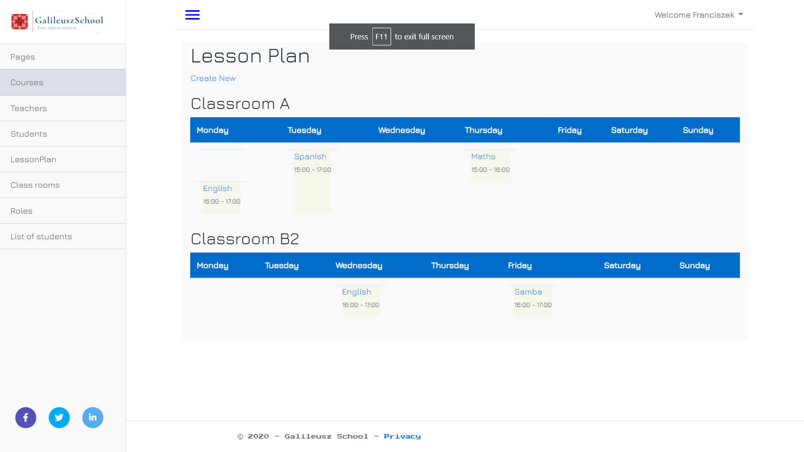

# GalileuszSchool - school administration tool

This project is inspired to be Student Information System and School Management System. It
is platform for school administrators, students and teachers to help them with everyday
tasks. For example: adding Students and Teachers info and other related data into DB, managing lesson plans, checking
attendance, students payments etc.

## Table of contents
* [Screenshots](#screenshots)
* [Technologies](#technologies)
* [Setup](#setup)
* [Features](#features)
* [Status](#status)
* [Contact](#contact)

## Screenshots

## Technologies
* Entity Framework 3.1.0 
* SqlServer 3.1.0
* ASP.NET MVC 5.2.7
* Bootstrap 4.3.1

## Setup

## Features
* adding new courses and lesson plans
* adding new students and teachers 
* connecting studnets/teacher with courses
* special admin panel 
* adding roles to specific users
* register and login into system
* visit social media accounts
* register email confirmation
* forgot password option

To-do:
* student's payment based on attendance
* homework panel

## Status
Project is: _in progress_

## Contact
franciszekezawadzki@gmail.com - feel free to contact me!
