# GalileuszSchool - school administration tool :school:

This project is inspired to be Student Information System and School Management System. It
is platform for school administrators, students and teachers to help them with everyday
tasks. For example: adding Students and Teachers info and other related data into DB, managing lesson plans, checking
attendance, students payments etc.

## Table of contents
* [Screenshots](#screenshots)
* [Technologies](#technologies)
* [Setup](#setup)
* [Features](#features)
* [Status](#status)
* [Contact](#contact)

## Screenshots
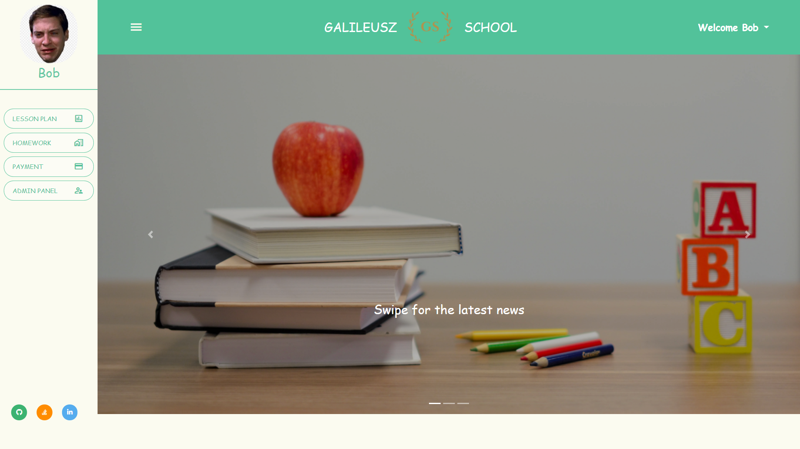

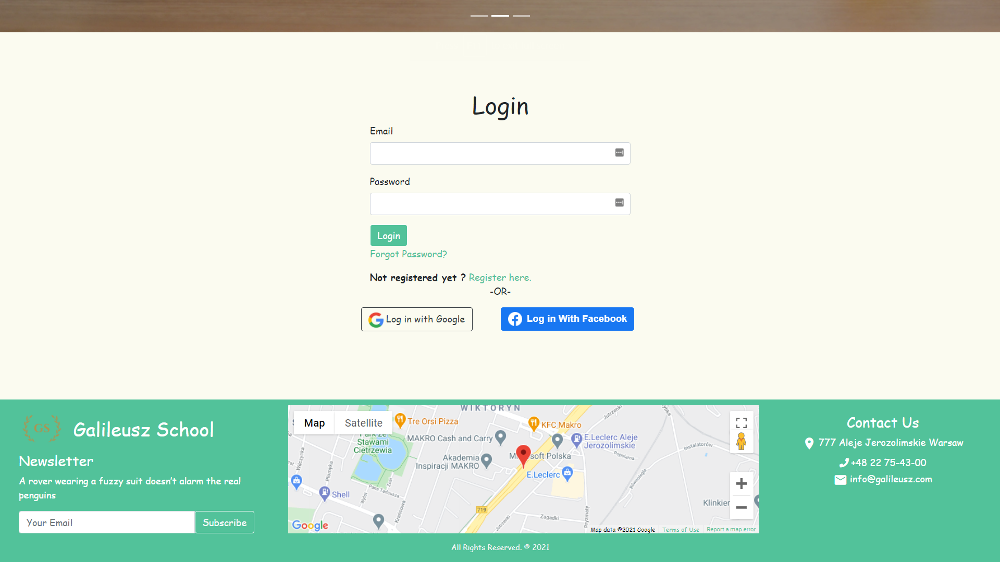

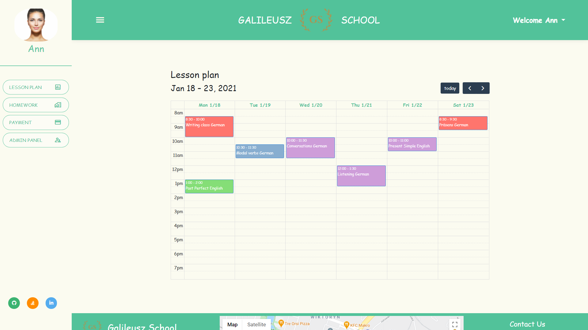

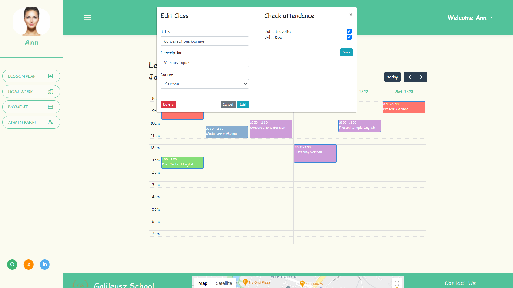

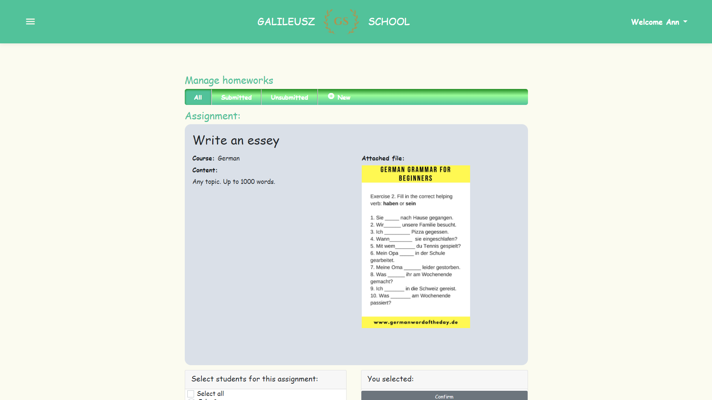

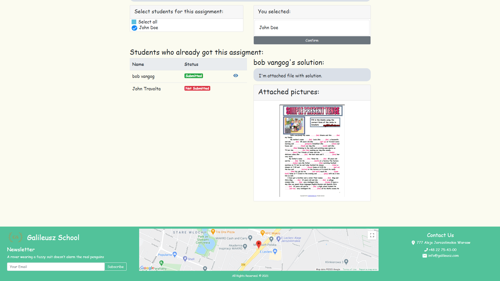

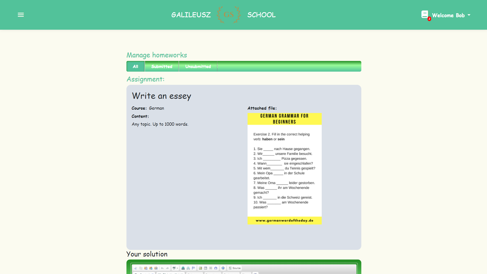

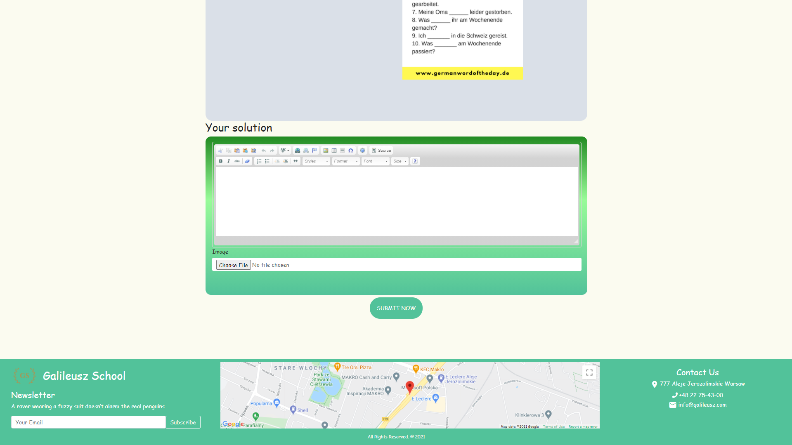

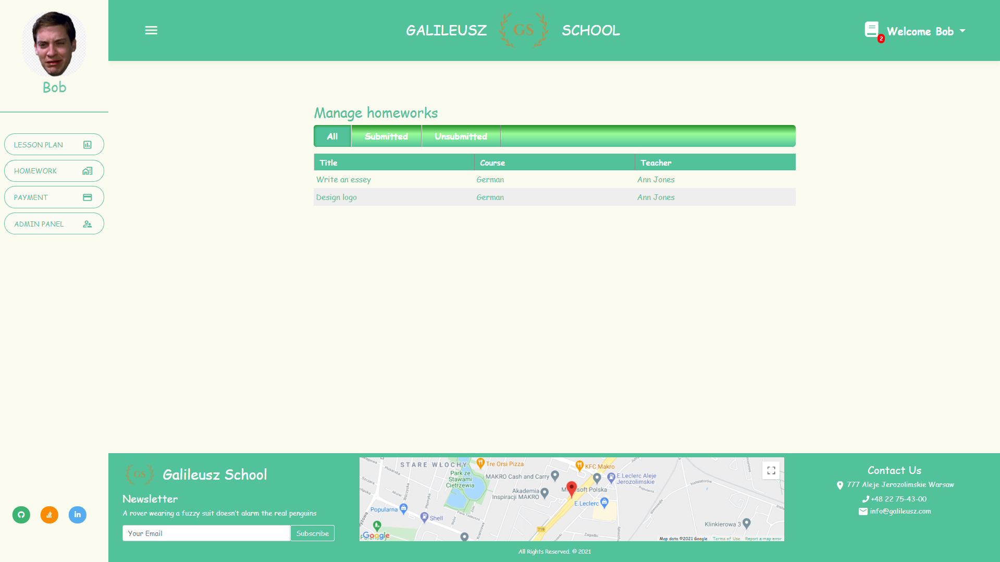

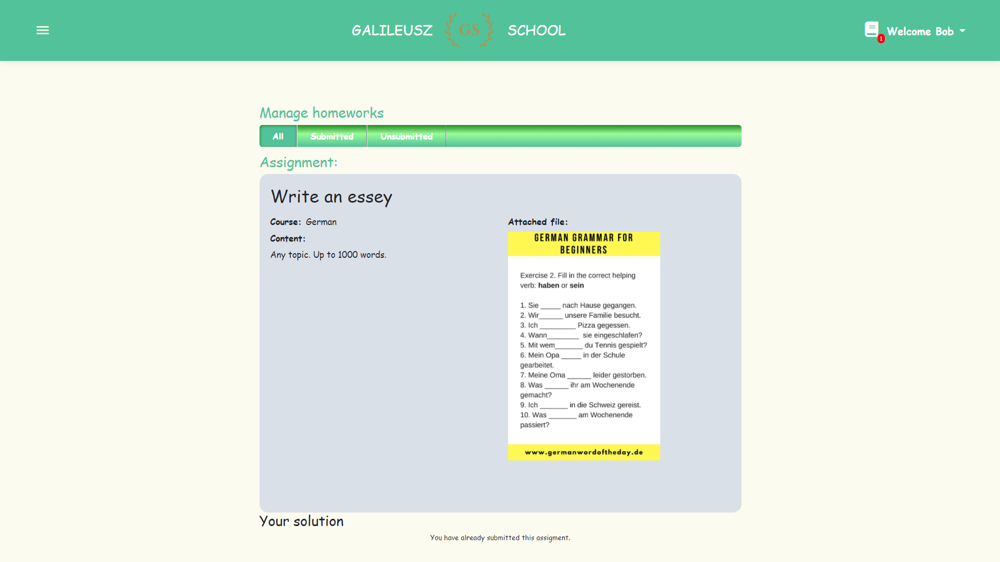

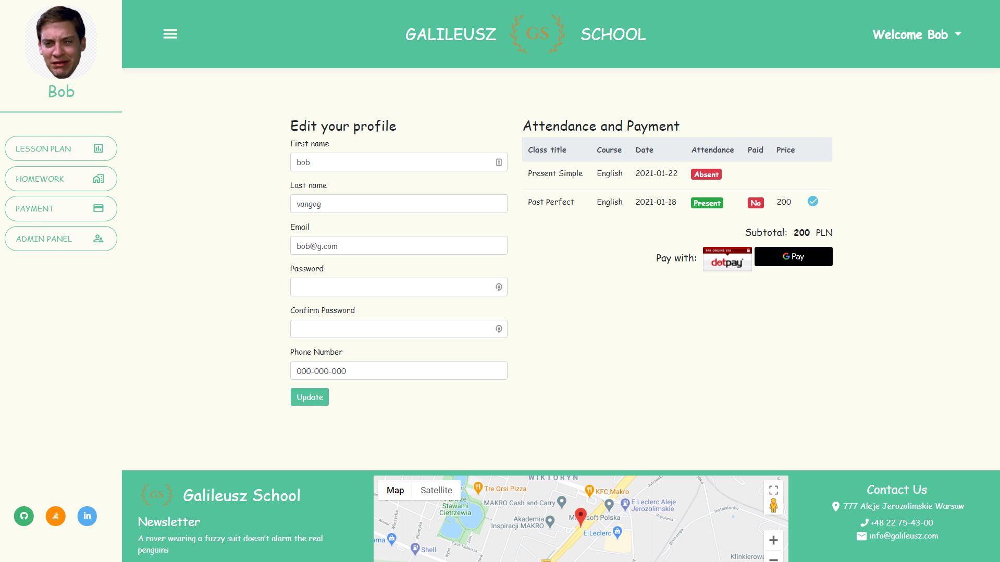

## Technologies
* ASP.NET Core 3.1
* Knockout 3.5.1
* Entity Framework 3.1.0 
* SqlServer 3.1.0
* Bootstrap 4.3.1

## Setup
Please clone the the repo, go to project directory and type _dotnet run_ in your terminal.

## Features
As a student we can:
* check the lesson plan
* check attendance 
* pay for each attended class
* check submitted/unsubmitted homeworks
* come up with homework's solution and send it back to the teacher
* edit profile

As a teacher we can:
* create and edit lesson plan
* check and save attendance for each student 
* create new homeworks
* give students homework
* check submitted/unsubmitted homeworks
* see students solutions
* edit profile

As an admin we can:
* add/edit/delete courses
* add/edit/delete students
* add/edit/delete teachers 
* assign courses to students and teacher
* add roles to specific users
* manage registered users

Other:
* registration system 
* email confirmation
* forgot password option
* see school location
* login with Facebook or Google

## Status
Project is: _on hold_

## Contact
:envelope: franciszekezawadzki@gmail.com - feel free to contact me!
